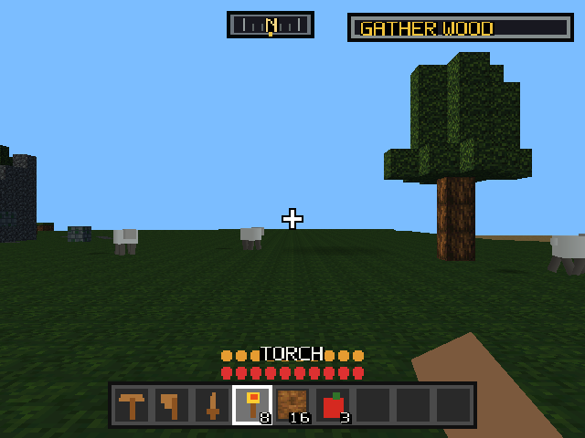
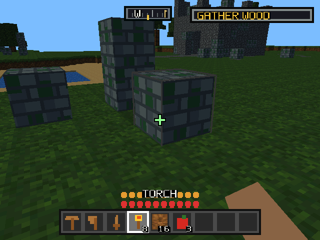
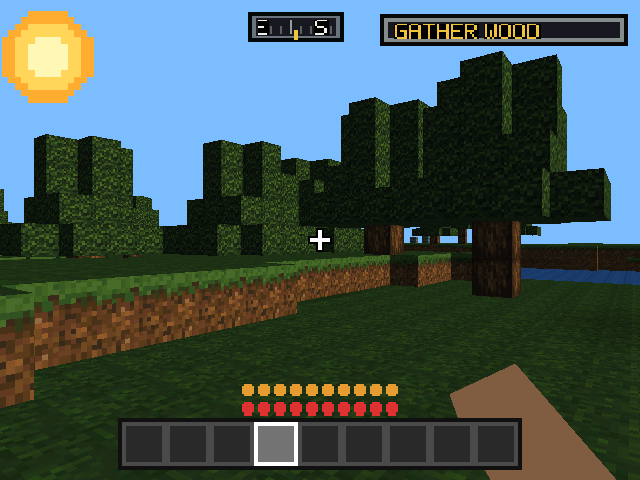
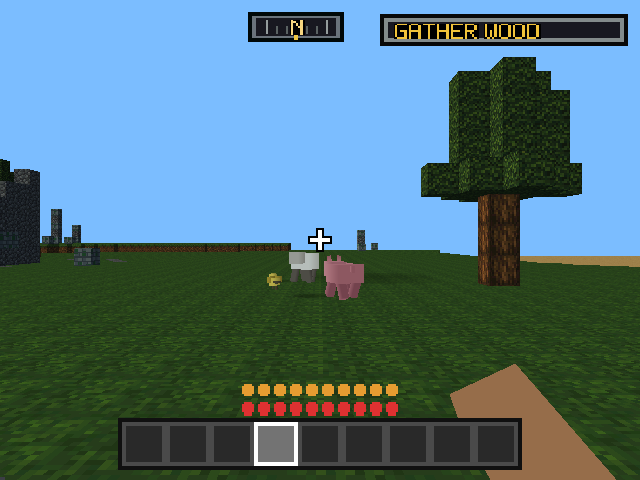
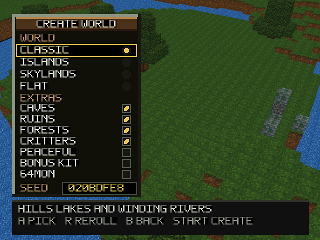
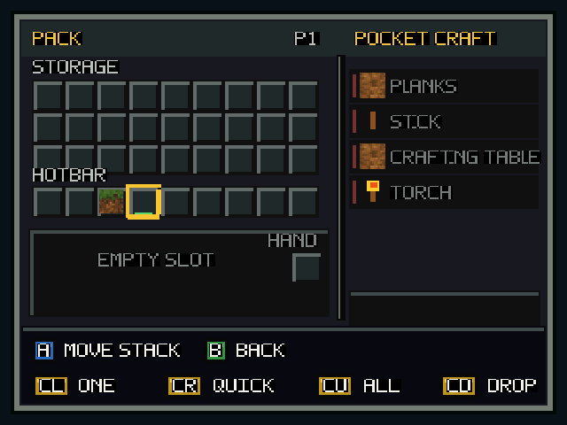

# Mine64

**An infinite-world block-building game for the Nintendo 64.** Runs on a stock
console — no Expansion Pak, no Minecraft assets, terrain generated as you walk.

<p align="center">
  
</p>

<p align="center">
  
  
  
</p>

## Features

**World**

- Endless in every direction — no borders, no loading screens, no map edge
- Terrain streamed and generated on the fly from a seed; walk back and it's the same
- Biomes: plains, forest, desert, jungle, highland, scree
- Oceans, lakes, rivers, mountains, cliffs, beaches, cave networks
- Trees that grow to fit — open-grown oaks spread wide, forest oaks go tall
- Hamlets, ruins and waystones to find
- Day/night cycle with a tilted sun and real moon phases; moonlight actually lights the ground
- Four world shapes (classic, islands, skylands, flat) plus toggles for caves, ruins, forests, critters, peaceful and bonus kit
- Original 16-colour tile art and UI font, generated at build time

**Play**

- Mine, place, and craft — no puzzle grid, ingredients come from your pack
- Wood/stone/iron tool tiers, each with its own in-hand silhouette
- Torches, doors, stairs, glass windows
- Hearts and hunger, fall damage, sprinting, swimming, ledge vaulting
- Hostile mobs at night that wind up visibly before they strike
- Sheep, pigs and chickens that track you, flee, breed and raise young
- Split-screen co-op for up to four players on one console
- Three save slots on flashcart SD, checksummed with backup-on-write
- **64MON**: optional creature-collecting mod with turn-based battles fought in-world, no battle screen — see [docs/64mon.md](docs/64mon.md)

<p align="center">
  
  
  
</p>

## Controls

| Control | Action |
| --- | --- |
| Analog stick | Left/right steers, up/down walks |
| Hold L | Sprint |
| Hold Z | Look around without turning |
| Z + C-up | Swap steering for strafing |
| A | Place, open door, use table, feed animal, eat |
| B | Hold to mine, tap to punch |
| R | Jump; hold to swim up |
| L + R while moving | Vault a one-block ledge |
| C-up | First / third person |
| C-left / C-right | Cycle hotbar |
| START or C-down | Open the pack |
| D-pad | Save |
| Controller 2–4 START | Join co-op |

The stick is a rudder, not a strafe: sideways turns you, so the camera always
points where you're going and lining up on the block in front of you never
means shuffling away from it. `Z + C-up` swaps it if you'd rather strafe.

## Building

Build the SDK image once, then the ROM:

```sh
docker build --platform linux/amd64 -t mine64-nusys-build:local -f docker/N64SDK.Dockerfile .
```

```sh
docker run --rm --platform linux/amd64 -v "$PWD:/work" -w /work mine64-nusys-build:local make -j2
```

Output is `build/mine64.n64`. With a SummerCart64 attached, `./live-load`
builds and streams to cart RAM; `./perma-load` writes it to the cart's SD card.

Full setup, deployment and the texture/music/SFX pipelines:
[docs/building.md](docs/building.md).

## Tools

`tools/preview` rasterises the game's own models on your machine, straight from
the vertex data in the source — the fast way to answer anything about pose,
framing or occlusion without booting a console:

```sh
tools/preview/mob.py pig --strip head-turn
```

`tools/emu` drives mupen64plus through a scripted controller timeline for
repeatable GUI screenshots. Neither tool settles performance or RDP behaviour;
those belong on hardware.

## Docs

| | |
| --- | --- |
| [Internals](docs/internals.md) | Endless-world streaming, meshing, save format, known gaps |
| [Hardware notes](docs/hardware.md) | Freeze diagnostics and hardware faults emulators don't reproduce |
| [RAM budget](docs/ram-budget.md) | Where the console's memory goes |
| [Building](docs/building.md) | SDK, ROM builds, flashcart deployment, asset pipelines |
| [64MON](docs/64mon.md) | Type chart, roster, design notes |
| [Offline preview](docs/offline-preview.md) | `tools/preview` reference |
| [Emulator screenshots](docs/emulator-screenshots.md) | `tools/emu` script grammar |
| [Custom textures](docs/custom-textures.md) | Art-to-cartridge workflow |

## Credits

Perlin noise by [nowl](https://gist.github.com/nowl/828013). Cartridge file
access via devwizard's [libcart](https://github.com/devwizard64/libcart); the
`src/ff` and `include/ff` directories come from that project.
