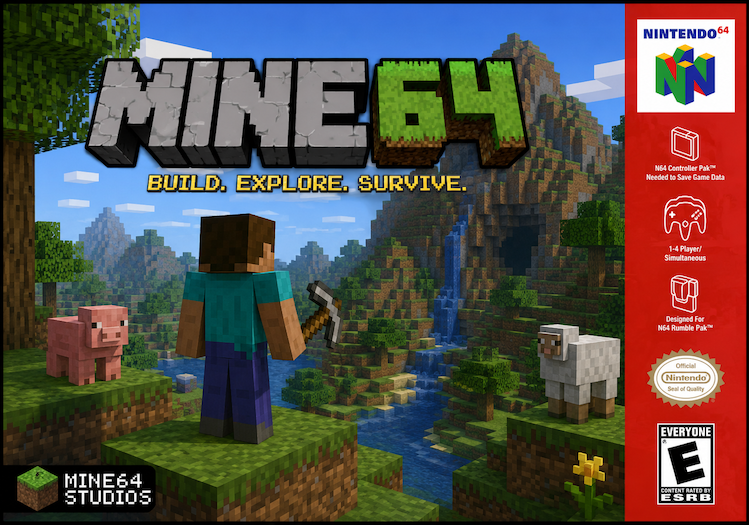

# Mine64 for Nintendo 64

Mine64 is a compact block-building game for original Nintendo 64 hardware.
Version 0.3 adds hardware-stable two-player co-op, deeper mining and crafting,
safer cartridge saves, and an asset pipeline that does not require Minecraft
files.




## v0.3 highlights

* Two-player horizontal split-screen: Player 2 can join a running world with
  **START** on Controller 2.
* Both players have independent movement, camera control, targeting, block
  selection, placement, breaking, inventory management, and crafting.
* Split-screen render commands and every camera/entity matrix are
  double-buffered. This prevents the RSP from reading a camera transform while
  the CPU prepares the following frame, an important difference on real N64
  hardware.
* Each player sees the other as a lightweight Steve-style character, with a
  walking swing and head/eye direction that follows their camera.
* Co-op saves both player positions and inventories; older single-player saves
  still load safely.
* Save v4 preserves exact hotbar, inventory, crafting, and carried-item state.
  It validates player/world data with a checksum and uses temporary plus backup
  files so an interrupted cartridge write can recover the previous world.
* All terrain can now be mined. Wooden pickaxes break stone, cobblestone, and
  bricks much faster, while wooden swords cut leaves quickly.
* Planks and crafting tables are properly consumed when placed, tools are
  non-stackable, dropped resources are protected when the entity pool is full,
  and partial inventory transfers can no longer duplicate items.
* Long frame hitches are clamped before physics simulation, preventing world
  generation or storage delays from pushing players through terrain.
* Co-op deliberately uses a narrower view and no more than 24 visible columns
  per player. This keeps the RSP and display-list workload within the limits of
  an unmodified N64.
* Original, generated 16-colour block tiles and UI font replace the former
  external Minecraft-art build dependency.

## Controls

| Control | Action |
| --- | --- |
| Analog stick | Walk |
| Hold L + analog stick | Sprint |
| Hold Z + analog stick | Look around |
| C-up | Toggle first-person / third-person camera |
| A / hold B | Place / mine the targeted block |
| C-left / C-right | Cycle the selected hotbar block |
| START | Open / close that player's inventory |
| R | Jump |
| D-pad (either player) | Save, when cartridge storage is available |
| Controller 2 START | Join co-op during a running world |

The bottom hotbar contains all nine placeable block types. Its bright slot and
the enlarged block at the lower right show what each player is holding; that is
the block placed with **A**. Mining a log, planks, or a crafting table makes a
collectible pickup pop out. Walk close to collect it into a stack of up to 64;
placing one of these resources consumes it. Hold B to mine—releasing B or
looking away resets the breaking progress. A wooden pickaxe is substantially
faster on rock, and a wooden sword clears leaves quickly.

Either player can press **START** to open their inventory. It has a 3-row
storage grid, a selectable nine-slot hotbar, and a working 2x2 crafting area.
Navigate with the analog stick, D-pad, or C-buttons. Use **A** to pick up/place
a stack or take the output, and **B** to move one item at a time. One log makes
four planks; two
vertical planks make four sticks; and four planks make a crafting table.
Place a crafting table, look at it, then press **START** to open its 3x3 grid
for wooden swords and wooden pickaxes.

## SummerCart64

For the normal SummerCart64 menu workflow, upload the built ROM to the
cartridge SD card, then select it in the menu. This is the persistent,
recommended deployment path:

```sh
../N64FlashcartMenu/tools/sc64/sc64deployer sd upload \
  build/mine64.n64 /Games/Mine64.n64
```

The menu path is `/Games/Mine64.n64`. The prior ROM is preserved as
`/Games/Mine64_original.64`; existing
`mine64/world_*.m64` save files are left alone. Saves are stored on the
cartridge SD card when libcart detects a supported flash cartridge.

For development-only USB streaming, with the SummerCart64 connected, use:

```sh
../N64FlashcartMenu/tools/sc64/sc64deployer upload build/mine64.n64
```

This sends the ROM to the cartridge's RAM and configures **Bootloader → ROM**;
it does not create or replace a file on the SD card. To bypass the bootloader
and start the uploaded ROM directly, add `--direct`.

## Build

Mine64 uses a modern compatibility environment rather than the original
proprietary Nintendo SDK. It contains the `mips-n64-*` cross compiler,
NuSystem, libultra, libcart, `spicy`, and `makemask`.

### SDK setup used for this build

The environment was assembled from the public
[ModernN64SDKArchives/n64sdkmod](https://github.com/ModernN64SDKArchives/n64sdkmod)
package archive. The source-controlled
[`docker/N64SDK.Dockerfile`](docker/N64SDK.Dockerfile) downloads the compiler
and newlib packages, sparse-checks out the NuSystem/libultra/libcart packages,
and installs them under the historical compatibility root `/etc/n64`.

On macOS, Linux, or Windows with Docker Desktop, build the Linux/amd64 image:

```sh
docker build --platform linux/amd64 \
  -t mine64-nusys-build:local \
  -f docker/N64SDK.Dockerfile .
```

`linux/amd64` is required because the archived host tools (`spicy` and the
cross compiler) are amd64 binaries. Docker Desktop handles this on Apple
Silicon.

### Build the ROM

Build inside that container:

```sh
docker run --rm --platform linux/amd64 \
  -v "$PWD:/work" -w /work \
  mine64-nusys-build:local make -j2
```

If you already installed a compatible SDK yourself, set `ROOT=/etc/n64` (or
the equivalent compatibility root) and run:

```
make
```

The ROM is written to `build/mine64.n64`. `generate_assets.py` runs
automatically and creates the compact original tile set and UI font required by
the game; no Minecraft assets are needed. The build uses
`toolchain/spicy-ld.sh` to bridge the historical makerom flags and
compiler-runtime objects to modern GNU ld.

The default is an optimized release ROM using the non-debug NuSystem and
libultra libraries. For an unoptimized SDK debug build, run `make DEBUG=1`.
Release and debug objects are cached separately, so switching variants is safe.

### Texture art exports

The game tiles are generated in `generate_assets.py` as 16x16 CI4 textures.
Export the current art for a viewer or paint workflow with:

```
python3 tools/export_textures.py
```

This writes `art/mine64-textures.png` (a native 64x48 atlas),
`art/mine64-textures-preview.png` (16x nearest-neighbour), and
`art/mine64-textures.json` (tile order and palette metadata).

### Custom texture import

Put an edited 4x3 PNG atlas at `art/custom-textures.png`. The first eleven
cells are used in this order: dirt, stone, grass top, grass side, cobblestone,
sand, log end, log side, leaves, planks, bricks; the final cell is ignored.
`make` automatically converts each cell into a 16x16, 16-colour CI4 tile.
The importer preserves crisp source pixels with nearest sampling and reduces
each tile to its own N64 palette.

### Music asset pipeline

The repository can prepare `Softstone Sunset.wav` and `Still Exploring.wav`
for a future hardware-tested music implementation. Keep the original WAVs in
one private local directory (the default is `/Users/codi/Downloads`) and create
N64-ready assets inside the same Docker environment used for ROM builds:

```sh
docker run --rm --platform linux/amd64 \
  -v "$PWD:/work" -v /Users/codi/Downloads:/music:ro -w /work \
  mine64-nusys-build:local make music MUSIC_SOURCE_DIR=/music
```

The pipeline downmixes each track to mono, resamples to 22,050 Hz, removes inaudible
sub-bass/ultrasonic content, normalizes peaks to -3 dBFS, and encodes the
result as N64 VADPCM. Outputs are written to `build/audio/`:
`music-*-22050-mono.wav` files are review copies, `music-*.vadpcm.aifc` files
are the compact encoded assets, and `music-*.json` files record exact size,
rate, duration, and codebook information.

VADPCM uses roughly 28% of the space of 16-bit PCM.  The default 22,050 Hz
mono asset is a strong quality/ROM-size balance for background music. To
prefer a smaller or clearer asset, set `MUSIC_RATE`, for example
`make music MUSIC_RATE=16000` or `make music MUSIC_RATE=32000`. To use a
different private source folder, set `MUSIC_SOURCE_DIR=/path/to/music`. To
keep the input's level and EQ unchanged, set `MUSIC_EFFECTS=`.

Music playback is intentionally not linked into the default ROM. The first
runtime integration could stall the shared RSP scheduler on real hardware, so
it remains disabled until its task scheduling and ROM streaming are validated
independently.

For the complete art-to-cartridge walkthrough, see
[Custom texture workflow](docs/custom-textures.md).

## Hardware notes

Mine64 renders the same world mesh for both cameras rather than duplicating the
world. In co-op it also submits one small, untextured Steve-style model per
viewport. The split-screen viewport shares the original framebuffer, and the
explicit co-op visibility cap keeps the main per-frame display list inside its
fixed hardware budget, including third-person avatars and pickups. All
per-frame display lists and referenced matrices are double-buffered so their
memory stays immutable until the RSP finishes.

The linked release program currently occupies about 2.1 MiB including its world,
geometry cache, NuSystem task buffers, and doubled render state. It remains
within the stock console's 4 MiB RDRAM; an Expansion Pak is not required.

## Technical Details

* The world consists of a 8x8 grid of "columns", each split into 4 vertical chunks of 8x8x8 blocks each.
* For each chunk a greedy scanning algorithm merges adjacent block faces with the same texture,
to reduce the number of quads that need to be rendered.
* `quads.h` contains the vertex data for all possible shapes and orientations of merged quad.
These quads are translated into place for rendering.
* Display lists for each column are recomputed every time a block changes in the column.
* Columns outside the camera view are culled by excluding their display lists from the main display list.

## Acknowledgements

Mine64 uses nowl's Perlin noise implementation in C: https://gist.github.com/nowl/828013

Mine64 uses devwizard's [libcart](https://github.com/devwizard64/libcart) library to access files on the cartridge.
The files in the `src/ff` and `include/ff` directories were copied from the libcart project.
